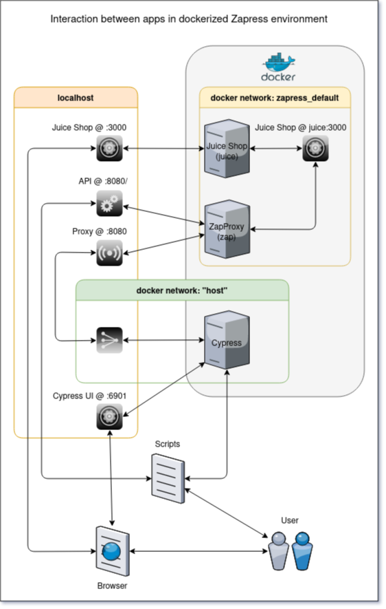

# Learn how to make your apps more secure with Cypress & OWASP ZAP

 This set of apps build an environment to learn how to test for threads in an web app.

 1. [OWASP Juice Shop](https://owasp.org/www-project-juice-shop/) is an example shop
 with intentional build in insecureties. The challange is to find them.\
 But this is more than only a shop. It shows you when you had discovered an insecurity
 or teach you in various lessons what they are and how to find them, as well. The
 project leader provides a book about this application and its use:\
 - Online: `https://pwning.owasp-juice.shop/`\
 - PDF/MOBI/EPUB: `https://leanpub.com/juice-shop`.
 2. [Cypress](https://www.cypress.io) is the new "Selenium", so an UI/E2E testing
 framework. It's awsome <find article link to post here>
 3. [OWASP ZAP](https://www.zaproxy.org/) is a security scanner for web apps. It can
 find potential vulnerabilities by analyse traffic using a proxy, passive and active
 scan and more.

# Preconditions

 1. (Required) [Docker](https://github.com/docker/docker-install) Do you need an
 explanation, really? Container based virtualization of apps or their parts, provided as
 a service.
 2. (Required) [Docker-Compose](https://github.com/docker/compose) is able to handle
 docker container in its context or dependancies (networks between,...).
 3. (Required) [NPM](https://github.com/npm/cli) is a java script package manager
 (node.js).
 4. (Optional but highly recommended) [NVM](https://github.com/nvm-sh/nvm) make id
 possible to switch between versions of npm per project. So one can run the application
 in the matching npm version.\
 Here the recommended version is v12.15.0 . All other can fail because of not matching
 the needs of the system.\
 NOTE: After version change one has to perform an "npm i" to install the dependancies!\
 HowTo: `https://ichi.pro/de/verwenden-sie-nvm-um-node-js-und-npm-versionen-zu-verwalten-48175851724703`

# In principle

## WARNING: Don't let run ZAP Active Scans against apps you do not have permission for!!!
###   Because these scans may harm the application/website and can be considered as an
###   attack. Recommendation: Read up on the subject ["ZAP"](https://www.zaproxy.org/).

 This project provides the Juice Shop and the ZAP proxy, each dockerized and runable as
 one environment. The as well dockarized Cypress application can be launched if needed.
 ZAP scans and Cypress tests can be run against the local Juice Shop or against one in
 the internet (especially installed for test purposes).\
 Cypress can be used in terminal or in graphical mode, as well.

 Sample options are realized in the script "make.sh". This script is the entrypoint into
 the world of Zapress and uses other scripts which have different tasks for the different
 apps in this project.

 In project directory only type

 ```bash
 ./make.sh
 ```

 to get an explanation about the possible options.

# How it works under the hood

 In general before one can run an active scan in ZAP, it has to know where it can try
 attacks (structure of the app/website). For that one can let run Cypress tests
 through the ZAP proxy (`http://localhost:8080`) or initiate a (ajax) spider scan
 (passive scan) against the app.\
 Only now it is prepared to start the active scan in ZAP.

 

# First steps:

## "Magig" behind that three apps run together
* The Zapproxy docker container: Different to the original docker container it uses
as entrypoint its bash script wrapper zap.sh with some default arguments. For more
infos please have a look in the Zap_Dockerfile.\
* When you want to use Cypress to teach ZAP about the site structure, its traffic
has to be run through the ZAP proxy.\
This is done by

```bash
export HTTP_PROXY=http://localhost:8080
export HTTPS_PROXY=http://localhost:8080
```

before running Cypress (in the same terminal window)!\
But this is build in for automatic execution, any time you start a Cypress test run.
* All other convinient stuff is done by sh scripts.

## Preparations

Install the needed dependancies, because they are not committed to git.

 ```bash
 npm i
 ```

 This is only needed before the very first use or if there are updates for dependancies,
 i.e. Cypress version change.\
 When you use nvm (as recommended, see chapter "Preconditions"), it is neccessary to
 follow its workflow (options in the make.sh are maybe helpful).

## Let it run (using only dockerized apps)

 1. Start dockerized environment - Juice Shop + ZAP

 ```bash
 ./make.sh -renv
 ```

 Now the Juice Shop is available via `http://localhost:3000` and\
 ZAP is ready: proxy via `http://localhost:8080`, scan api `http://localhost:8080/UI`.

 2. Run Cypress tests

 ```bash
 ./make.sh -cdhl
 ```

 This option sets up the route through the ZAP proxy and starts all available tests in
 a dockerized Cypress, headless (Chrome) against the Juice Shop (see step 1.).

 3. Enable only some active scan types

 ```bash
 ./make.sh -z -eas
 ```

 As standart there are all types of active scans switched on. But this results in an
 exited run, because it lasts to long. This setup is persistent, if you do not restart
 the Zap container. So you don't have to do it every run.

 4. Run ZAP active scan

 ```bash
 ./make.sh -zahl
 ```

Now ZAP knows something about the structure of the Juice Shop and use this for
attacks (active scans).\
Watch out where you can find the file with the scan result (terminal).

# Next steps

  So, if you are a little familiar with this, you can:
  - use other options as well (make.sh, zapScan.sh, runCypressTests.sh)
  - add or change options which matches your needs
  - add new tests in Cypress
  - run spider scans in ZAP
  - add config files for run zap scans which matches your needs
  - accept challanges in the Juice Shop
  - read the book to the Juice Shop and learn something about security
  - ...

# Vizualize

 Juice Shop: `http://localhost:3000`
 Cypress, vizual mode (if it runs in this mode): `http://localhost:6901/`

# Help from you!

 Sure, this readme may include not everything you expected. Let me know and I try to
 add topics to clearify questions.


# Inspiration
 Zapress was inspired by the project "jverhoelen/owasp-zap-with-entrypoint".
 Unfortunately this project seems to be abandond and had dependencies to an other not
 supported project of the same author.\
 So I decided to build this new only whith dependencies which are well maintained.
